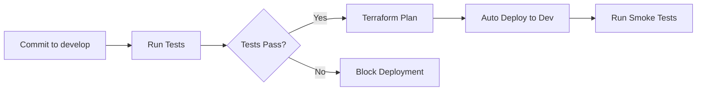
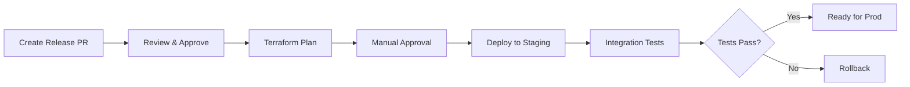
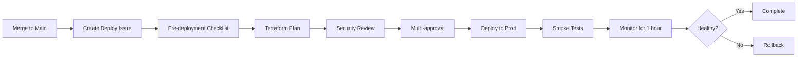

# Environment Strategy

**Version:** 1.0  
**Last Updated:** January 12, 2026  
**Status:** Approved

## Overview

This document defines the multi-environment strategy for the Synthetic Data Generator Agent project, including environment configurations, promotion workflows, and deployment policies.

---

## Table of Contents

1. [Environment Overview](#environment-overview)
2. [Environment Configurations](#environment-configurations)
3. [Deployment Workflow](#deployment-workflow)
4. [Infrastructure Differences](#infrastructure-differences)
5. [Data Management](#data-management)
6. [Access Control](#access-control)
7. [Testing Strategy](#testing-strategy)

---

## Environment Overview

### Environment Hierarchy

```
Development (dev)
    ↓ Auto-deploy on merge to develop
Staging (stg)
    ↓ Manual promotion after validation
Production (prod)
    ↓ Manual promotion with approvals
```

### Environment Purposes

| Environment | Purpose | Audience | Change Frequency | Uptime Target |
|-------------|---------|----------|------------------|---------------|
| **Development** | Active development and testing | Developers | High (multiple per day) | 95% |
| **Staging** | Pre-production validation | QA, Product | Medium (daily) | 99% |
| **Production** | Live customer-facing system | End users | Low (weekly/bi-weekly) | 99.9% |

---

## Environment Configurations

### Development Environment (dev)

**Purpose:** Active development, feature testing, and experimentation

**Characteristics:**
- Lower cost configurations
- Aggressive data retention policies
- Extensive logging and debugging
- Relaxed rate limiting
- Automated deployments
- Quick iteration cycles

**Configuration:**

```hcl
# terraform.tfvars - dev
environment = "dev"
aws_region  = "us-east-1"

# Bedrock Agent
bedrock_agent_name           = "sdga-datagen-agent-dev"
bedrock_foundation_model     = "anthropic.claude-3-sonnet-20240229-v1:0"
bedrock_agent_idle_timeout   = 600

# Lambda Configuration
lambda_generate_memory       = 1024  # MB
lambda_generate_timeout      = 300   # seconds
lambda_validate_memory       = 512
lambda_validate_timeout      = 60
lambda_metrics_memory        = 512
lambda_metrics_timeout       = 120
lambda_reserved_concurrency  = 5     # Lower for dev

# Storage
s3_generated_data_retention_days     = 30   # Shorter retention
s3_lifecycle_ia_days                 = 30
s3_lifecycle_glacier_days            = 60
s3_lifecycle_expiration_days         = 90
s3_versioning_enabled                = true

# DynamoDB
dynamodb_billing_mode                = "PAY_PER_REQUEST"
dynamodb_point_in_time_recovery      = false  # Not critical for dev
dynamodb_ttl_enabled                 = true
dynamodb_ttl_days                    = 30

# OpenSearch Serverless
opensearch_capacity_units            = 2      # Minimum

# Monitoring
cloudwatch_log_retention_days        = 7      # Shorter retention
cloudwatch_detailed_monitoring       = false

# Security
enable_vpc                           = false  # Public Lambda for dev
enable_waf                           = false
kms_key_rotation                     = false  # Reduce costs
mfa_delete_enabled                   = false

# Cost Control
budget_limit_monthly                 = 200    # USD

# Tags
tags = {
  Project            = "Synthetic Data Generator Agent"
  Environment        = "dev"
  ManagedBy          = "Terraform"
  Owner              = "data-platform-team"
  CostCenter         = "engineering"
  DataClassification = "internal"
}
```

**Deployment Trigger:**
- Automatic on merge to `develop` branch
- Automatic on commit to feature branches (optional)

**Access:**
- All team members have admin access
- No MFA required for service access
- Temporary credentials allowed

---

### Staging Environment (stg)

**Purpose:** Pre-production validation, integration testing, UAT

**Characteristics:**
- Production-like configuration
- Moderate data retention
- Standard logging
- Production-like performance testing
- Manual deployment approval
- Controlled promotion workflow

**Configuration:**

```hcl
# terraform.tfvars - stg
environment = "stg"
aws_region  = "us-east-1"

# Bedrock Agent
bedrock_agent_name           = "sdga-datagen-agent-stg"
bedrock_foundation_model     = "anthropic.claude-3-sonnet-20240229-v1:0"
bedrock_agent_idle_timeout   = 900

# Lambda Configuration
lambda_generate_memory       = 1536  # MB - Higher than dev
lambda_generate_timeout      = 300
lambda_validate_memory       = 512
lambda_validate_timeout      = 60
lambda_metrics_memory        = 512
lambda_metrics_timeout       = 120
lambda_reserved_concurrency  = 10    # Moderate concurrency

# Storage
s3_generated_data_retention_days     = 90
s3_lifecycle_ia_days                 = 90
s3_lifecycle_glacier_days            = 180
s3_lifecycle_expiration_days         = 365
s3_versioning_enabled                = true

# DynamoDB
dynamodb_billing_mode                = "PAY_PER_REQUEST"
dynamodb_point_in_time_recovery      = true   # Enable backup
dynamodb_ttl_enabled                 = true
dynamodb_ttl_days                    = 90

# OpenSearch Serverless
opensearch_capacity_units            = 4      # Moderate capacity

# Monitoring
cloudwatch_log_retention_days        = 30
cloudwatch_detailed_monitoring       = true

# Security
enable_vpc                           = true   # Private networking
enable_waf                           = false  # Optional
kms_key_rotation                     = true
mfa_delete_enabled                   = false

# Cost Control
budget_limit_monthly                 = 500    # USD

# Tags
tags = {
  Project            = "Synthetic Data Generator Agent"
  Environment        = "stg"
  ManagedBy          = "Terraform"
  Owner              = "data-platform-team"
  CostCenter         = "engineering"
  DataClassification = "internal"
}
```

**Deployment Trigger:**
- Manual approval after dev validation
- Automated tests must pass
- Weekly deployment window (Tuesdays)

**Access:**
- Team leads and DevOps have admin access
- Developers have read-only access
- MFA required for console access

---

### Production Environment (prod)

**Purpose:** Live customer-facing system

**Characteristics:**
- Maximum reliability and performance
- Extended data retention
- Comprehensive monitoring
- Strict change control
- Manual deployment with multiple approvals
- Business hours deployment window

**Configuration:**

```hcl
# terraform.tfvars - prod
environment = "prod"
aws_region  = "us-east-1"

# Bedrock Agent
bedrock_agent_name           = "sdga-datagen-agent-prod"
bedrock_foundation_model     = "anthropic.claude-3-sonnet-20240229-v1:0"
bedrock_agent_idle_timeout   = 1800

# Lambda Configuration
lambda_generate_memory       = 2048  # MB - Maximum for prod
lambda_generate_timeout      = 300
lambda_validate_memory       = 1024  # Higher for prod
lambda_validate_timeout      = 60
lambda_metrics_memory        = 1024
lambda_metrics_timeout       = 120
lambda_reserved_concurrency  = 50    # High concurrency

# Storage
s3_generated_data_retention_days     = 365
s3_lifecycle_ia_days                 = 90
s3_lifecycle_glacier_days            = 180
s3_lifecycle_expiration_days         = 730  # 2 years
s3_versioning_enabled                = true
s3_cross_region_replication          = true  # DR

# DynamoDB
dynamodb_billing_mode                = "PAY_PER_REQUEST"
dynamodb_point_in_time_recovery      = true
dynamodb_ttl_enabled                 = true
dynamodb_ttl_days                    = 365
dynamodb_global_tables               = false  # Future: multi-region

# OpenSearch Serverless
opensearch_capacity_units            = 8      # High capacity

# Monitoring
cloudwatch_log_retention_days        = 90
cloudwatch_detailed_monitoring       = true
enable_enhanced_monitoring           = true

# Security
enable_vpc                           = true
enable_waf                           = true
kms_key_rotation                     = true
mfa_delete_enabled                   = true
enable_guardduty                     = true
enable_security_hub                  = true
enable_config                        = true

# Cost Control
budget_limit_monthly                 = 2000   # USD
enable_cost_anomaly_detection        = true

# Backup
backup_retention_days                = 35
enable_cross_region_backup           = true

# Tags
tags = {
  Project            = "Synthetic Data Generator Agent"
  Environment        = "prod"
  ManagedBy          = "Terraform"
  Owner              = "data-platform-team"
  CostCenter         = "engineering"
  DataClassification = "confidential"
  Compliance         = "SOC2,GDPR"
  BackupPolicy       = "daily"
}
```

**Deployment Trigger:**
- Manual approval by Tech Lead + Product Manager
- All tests passed in staging
- Deployment window: Tuesday/Thursday, 10 AM - 2 PM EST
- Rollback plan documented
- On-call engineer available

**Access:**
- Production access restricted to DevOps and on-call engineers
- MFA required for all access
- All actions logged and audited
- Read-only access for developers via designated role

---

## Deployment Workflow

### Branching Strategy

```
main (production)
  ↑
  └── release/v1.x (staging)
       ↑
       └── develop (development)
            ↑
            └── feature/* (feature branches)
```

### Deployment Pipeline

#### 1. Development Deployment



**GitHub Actions Workflow:**
```yaml
name: Deploy to Development

on:
  push:
    branches: [develop]

jobs:
  deploy:
    runs-on: ubuntu-latest
    environment: dev
    steps:
      - uses: actions/checkout@v3
      
      - name: Configure AWS Credentials
        uses: aws-actions/configure-aws-credentials@v2
        with:
          role-to-assume: ${{ secrets.DEV_DEPLOY_ROLE_ARN }}
          aws-region: us-east-1
      
      - name: Setup Terraform
        uses: hashicorp/setup-terraform@v2
        with:
          terraform_version: 1.6.0
      
      - name: Terraform Init
        run: terraform init
        working-directory: Infrastructure/terraform
      
      - name: Terraform Plan
        run: terraform plan -var-file=environments/dev.tfvars
        working-directory: Infrastructure/terraform
      
      - name: Terraform Apply
        run: terraform apply -auto-approve -var-file=environments/dev.tfvars
        working-directory: Infrastructure/terraform
      
      - name: Run Smoke Tests
        run: ./scripts/smoke-tests.sh dev
        working-directory: Infrastructure
```

#### 2. Staging Deployment



**GitHub Actions Workflow:**
```yaml
name: Deploy to Staging

on:
  push:
    branches: [release/*]

jobs:
  deploy:
    runs-on: ubuntu-latest
    environment: staging
    steps:
      - uses: actions/checkout@v3
      
      - name: Configure AWS Credentials
        uses: aws-actions/configure-aws-credentials@v2
        with:
          role-to-assume: ${{ secrets.STG_DEPLOY_ROLE_ARN }}
          aws-region: us-east-1
      
      - name: Setup Terraform
        uses: hashicorp/setup-terraform@v2
      
      - name: Terraform Init
        run: terraform init
        working-directory: Infrastructure/terraform
      
      - name: Terraform Plan
        run: terraform plan -var-file=environments/stg.tfvars -out=tfplan
        working-directory: Infrastructure/terraform
      
      - name: Upload Plan
        uses: actions/upload-artifact@v3
        with:
          name: tfplan
          path: Infrastructure/terraform/tfplan
      
      - name: Wait for Approval
        uses: trstringer/manual-approval@v1
        with:
          approvers: tech-leads
          minimum-approvals: 1
      
      - name: Terraform Apply
        run: terraform apply tfplan
        working-directory: Infrastructure/terraform
      
      - name: Run Integration Tests
        run: ./scripts/integration-tests.sh stg
        working-directory: Infrastructure
```

#### 3. Production Deployment



**GitHub Actions Workflow:**
```yaml
name: Deploy to Production

on:
  workflow_dispatch:
    inputs:
      version:
        description: 'Version to deploy'
        required: true

jobs:
  pre-deployment:
    runs-on: ubuntu-latest
    steps:
      - name: Verify Business Hours
        run: |
          hour=$(date +%H)
          day=$(date +%u)
          if [ $day -gt 5 ] || [ $hour -lt 10 ] || [ $hour -gt 14 ]; then
            echo "Deployments only allowed Tue/Thu 10 AM - 2 PM EST"
            exit 1
          fi
      
      - name: Check Staging Health
        run: ./scripts/check-environment-health.sh stg
  
  deploy:
    needs: pre-deployment
    runs-on: ubuntu-latest
    environment: production
    steps:
      - uses: actions/checkout@v3
        with:
          ref: ${{ github.event.inputs.version }}
      
      - name: Configure AWS Credentials
        uses: aws-actions/configure-aws-credentials@v2
        with:
          role-to-assume: ${{ secrets.PROD_DEPLOY_ROLE_ARN }}
          aws-region: us-east-1
      
      - name: Setup Terraform
        uses: hashicorp/setup-terraform@v2
      
      - name: Terraform Init
        run: terraform init
        working-directory: Infrastructure/terraform
      
      - name: Terraform Plan
        run: terraform plan -var-file=environments/prod.tfvars -out=tfplan
        working-directory: Infrastructure/terraform
      
      - name: Security Scan
        run: |
          # Run tfsec or similar
          tfsec Infrastructure/terraform
      
      - name: Wait for Multi-approval
        uses: trstringer/manual-approval@v1
        with:
          approvers: tech-leads,product-managers
          minimum-approvals: 2
      
      - name: Backup Current State
        run: ./scripts/backup-state.sh prod
        working-directory: Infrastructure
      
      - name: Terraform Apply
        run: terraform apply tfplan
        working-directory: Infrastructure/terraform
      
      - name: Run Smoke Tests
        run: ./scripts/smoke-tests.sh prod
        working-directory: Infrastructure
      
      - name: Monitor Deployment
        run: ./scripts/monitor-deployment.sh prod 3600
        working-directory: Infrastructure
  
  rollback:
    if: failure()
    needs: deploy
    runs-on: ubuntu-latest
    steps:
      - name: Execute Rollback
        run: ./scripts/rollback.sh prod
        working-directory: Infrastructure
```

### Rollback Procedure

**Automated Rollback Triggers:**
- Smoke tests fail
- Error rate > 5% in first 15 minutes
- P50 latency increase > 50%
- Manual trigger by on-call engineer

**Rollback Steps:**
1. Revert Terraform to previous state
2. Restore from backup if data corruption
3. Verify health checks pass
4. Post-mortem analysis

---

## Infrastructure Differences

### Resource Sizing by Environment

| Component | Development | Staging | Production |
|-----------|-------------|---------|------------|
| **Lambda Memory (Generate)** | 1024 MB | 1536 MB | 2048 MB |
| **Lambda Memory (Validate)** | 512 MB | 512 MB | 1024 MB |
| **Lambda Memory (Metrics)** | 512 MB | 512 MB | 1024 MB |
| **Lambda Concurrency** | 5 | 10 | 50 |
| **OpenSearch OCUs** | 2 | 4 | 8 |
| **DynamoDB Mode** | On-Demand | On-Demand | On-Demand* |
| **CloudWatch Retention** | 7 days | 30 days | 90 days |
| **S3 Data Retention** | 90 days | 365 days | 730 days |

*Consider provisioned capacity if usage is predictable

### Feature Flags by Environment

| Feature | Development | Staging | Production |
|---------|-------------|---------|------------|
| VPC Networking | ❌ | ✅ | ✅ |
| AWS WAF | ❌ | ❌ | ✅ |
| Cross-Region Replication | ❌ | ❌ | ✅ |
| GuardDuty | ❌ | ✅ | ✅ |
| Security Hub | ❌ | ✅ | ✅ |
| AWS Config | ❌ | ✅ | ✅ |
| Enhanced Monitoring | ❌ | ✅ | ✅ |
| MFA Delete | ❌ | ❌ | ✅ |
| KMS Key Rotation | ❌ | ✅ | ✅ |

---

## Data Management

### Data Seeding

**Development:**
- Synthetic test data automatically generated
- Pre-populated knowledge base with sample schemas
- Anonymized production data (optional)

**Staging:**
- Production-like data volumes
- Sanitized copy of production schemas
- Regular refresh from production (weekly)

**Production:**
- Customer-provided schemas
- Real usage patterns
- No test data

### Data Migration

**Strategy:**
- Blue-green deployment for database schema changes
- DynamoDB data migration scripts
- S3 data versioning for rollback
- Knowledge base re-indexing automation

### Backup and Restore

| Environment | Backup Frequency | Retention | Cross-Region |
|-------------|-----------------|-----------|--------------|
| Development | None | N/A | No |
| Staging | Daily | 7 days | No |
| Production | Daily | 35 days | Yes |

---

## Access Control

### IAM Structure

```
AWS Organization
├── Development Account
│   ├── Developers (PowerUser)
│   ├── DevOps (Admin)
│   └── CI/CD Role
├── Staging Account
│   ├── Developers (ReadOnly)
│   ├── QA (PowerUser)
│   ├── DevOps (Admin)
│   └── CI/CD Role
└── Production Account
    ├── Developers (ReadOnly via break-glass)
    ├── DevOps (Admin via MFA)
    ├── On-call (Incident Response)
    └── CI/CD Role (Deploy only)
```

### Access Policies

**Development:**
- Team members: Full access
- CI/CD: Full deployment access
- MFA: Not required
- Session duration: 12 hours

**Staging:**
- Developers: Read-only
- QA/DevOps: Admin access
- CI/CD: Deployment access
- MFA: Required for console
- Session duration: 8 hours

**Production:**
- Developers: No access (break-glass only)
- DevOps: Admin via MFA
- On-call: Incident response access
- CI/CD: Deployment access (restricted window)
- MFA: Required for all access
- Session duration: 4 hours
- All actions logged and audited

### Break-Glass Access

**Procedure for Production Emergency Access:**
1. Create incident ticket
2. Request break-glass access
3. Approval from Tech Lead + On-call
4. Access granted for 1 hour
5. All actions logged
6. Post-incident review required

---

## Testing Strategy

### Development Testing

**Automated Tests:**
- Unit tests for Lambda functions
- Integration tests for action groups
- Terraform validation and linting
- Security scanning (tfsec, checkov)

**Manual Testing:**
- Feature validation
- UI/UX testing (if applicable)
- Performance testing (basic)

### Staging Testing

**Automated Tests:**
- Full integration test suite
- End-to-end workflow tests
- Performance and load testing
- Security penetration testing
- Compliance validation

**Manual Testing:**
- User acceptance testing (UAT)
- Cross-browser testing
- Regression testing
- Business process validation

### Production Testing

**Automated Tests:**
- Smoke tests post-deployment
- Synthetic monitoring
- Health check endpoints
- Canary deployments

**Manual Testing:**
- Limited post-deployment validation
- Business continuity testing (quarterly)

---

## Cost Management

### Budget Alerts by Environment

```hcl
# Development
resource "aws_budgets_budget" "dev" {
  name              = "sdga-dev-monthly-budget"
  budget_type       = "COST"
  limit_amount      = "200"
  limit_unit        = "USD"
  time_period_start = "2026-01-01_00:00"
  time_unit         = "MONTHLY"

  notification {
    comparison_operator        = "GREATER_THAN"
    threshold                  = 80
    threshold_type            = "PERCENTAGE"
    notification_type         = "ACTUAL"
    subscriber_email_addresses = ["team@example.com"]
  }
}

# Staging
resource "aws_budgets_budget" "stg" {
  name         = "sdga-stg-monthly-budget"
  budget_type  = "COST"
  limit_amount = "500"
  limit_unit   = "USD"
  time_unit    = "MONTHLY"

  notification {
    comparison_operator        = "GREATER_THAN"
    threshold                  = 80
    threshold_type            = "PERCENTAGE"
    notification_type         = "ACTUAL"
    subscriber_email_addresses = ["devops@example.com"]
  }
}

# Production
resource "aws_budgets_budget" "prod" {
  name         = "sdga-prod-monthly-budget"
  budget_type  = "COST"
  limit_amount = "2000"
  limit_unit   = "USD"
  time_unit    = "MONTHLY"

  notification {
    comparison_operator        = "GREATER_THAN"
    threshold                  = 80
    threshold_type            = "PERCENTAGE"
    notification_type         = "FORECASTED"
    subscriber_email_addresses = ["finance@example.com", "devops@example.com"]
  }
}
```

### Cost Optimization

**Development:**
- Use spot instances for batch jobs (if applicable)
- Shut down non-critical resources after hours
- Use minimal capacity settings
- Short data retention

**Staging:**
- Right-size based on usage patterns
- Use scheduled scaling
- Optimize storage tiers
- Regular cost reviews

**Production:**
- Reserved capacity for predictable workloads
- Savings plans for compute
- S3 Intelligent-Tiering
- Continuous cost optimization

---

## Environment Comparison Matrix

| Aspect | Development | Staging | Production |
|--------|-------------|---------|------------|
| **Uptime SLA** | 95% | 99% | 99.9% |
| **Deployment Frequency** | Multiple/day | Daily | Weekly |
| **Approval Required** | No | 1 person | 2+ people |
| **Change Window** | Anytime | Business hours | Tue/Thu 10-14 EST |
| **Rollback Time** | < 30 min | < 1 hour | < 15 min |
| **Data Retention** | 90 days | 365 days | 730 days |
| **Backup Frequency** | None | Daily | Daily + PITR |
| **Monitoring Detail** | Basic | Standard | Enhanced |
| **Cost Budget** | $200/month | $500/month | $2000/month |
| **Access Level** | Full team | Limited | Restricted |

---

## Terraform Workspace Strategy

### Using Terraform Workspaces

```bash
# Initialize Terraform
terraform init

# Create and select workspace
terraform workspace new dev
terraform workspace new stg
terraform workspace new prod

# Select workspace
terraform workspace select dev

# Plan with environment-specific vars
terraform plan -var-file=environments/dev.tfvars

# Apply
terraform apply -var-file=environments/dev.tfvars
```

### Workspace Configuration

```hcl
# main.tf
locals {
  environment = terraform.workspace
  
  config = {
    dev = {
      lambda_memory     = 1024
      lambda_timeout    = 300
      enable_vpc        = false
      enable_waf        = false
    }
    stg = {
      lambda_memory     = 1536
      lambda_timeout    = 300
      enable_vpc        = true
      enable_waf        = false
    }
    prod = {
      lambda_memory     = 2048
      lambda_timeout    = 300
      enable_vpc        = true
      enable_waf        = true
    }
  }
  
  current_config = local.config[local.environment]
}

resource "aws_lambda_function" "generate" {
  function_name = "sdga-datagen-lambda-${local.environment}-generate"
  memory_size   = local.current_config.lambda_memory
  timeout       = local.current_config.lambda_timeout
  # ...
}
```

---

## Environment Validation Checklist

### Pre-Deployment Validation

**Development:**
- [ ] Terraform plan successful
- [ ] Unit tests pass
- [ ] Linting checks pass
- [ ] No security vulnerabilities (critical)

**Staging:**
- [ ] All dev checks pass
- [ ] Integration tests pass
- [ ] Performance tests pass
- [ ] Security scan clean
- [ ] Team lead approval

**Production:**
- [ ] All staging checks pass
- [ ] Load tests pass
- [ ] Security audit complete
- [ ] Compliance validation done
- [ ] Rollback plan documented
- [ ] On-call engineer notified
- [ ] Business hours deployment window
- [ ] Multi-person approval obtained

### Post-Deployment Validation

**All Environments:**
- [ ] Smoke tests pass
- [ ] Health checks green
- [ ] No error spikes in logs
- [ ] Metrics within expected ranges
- [ ] No security alerts triggered

---

## References

- [AWS Multi-Account Strategy](https://docs.aws.amazon.com/whitepapers/latest/organizing-your-aws-environment/)
- [Terraform Workspaces](https://www.terraform.io/docs/language/state/workspaces.html)
- [GitOps Principles](https://www.gitops.tech/)
- [Continuous Delivery](https://continuousdelivery.com/)

---

**Document Owner:** DevOps Team  
**Approved By:** Technical Lead  
**Review Cycle:** Quarterly  
**Next Review:** April 2026
